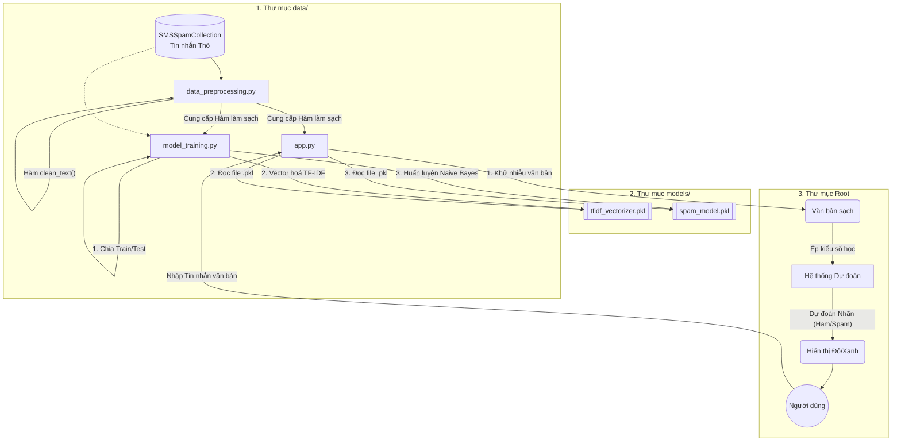

# Luồng Dữ Liệu (Data Flow) & Kiến Trúc Hệ Thống

Để có thể bảo vệ đồ án hoặc báo cáo một cách trơn tru, đây là giải phẫu chi tiết về cách mà cả hệ thống 3 Module của chúng ta hoạt động cùng nhau.

## 1. Sơ đồ Luồng Hoạt động (Mermaid Architecture)

Dưới đây là sơ đồ chi tiết dòng chảy dữ liệu (Data Flow) từ lúc Train hệ thống cho tới khi chạy thực tế trên Web.

---

## 2. Giải phẫu Từng File: In/Out (Đầu vào / Đầu ra)

Hệ thống được thiết kế theo tư duy **Decoupled (Tách rời)**, file nào làm việc file đó, không bị phụ thuộc vòng tròn.

### 📌 File: `data/data_preprocessing.py`
Chịu trách nhiệm lọc rác (noise) trong ngôn ngữ. Khâu này cốt lõi là làm thế nào để chữ "Free!!!", "FREE", "free" đều được hiểu là cùng một chữ.
- **Input (Đầu vào):** Data thô. Câu chứa dấu câu phức tạp (VD: `"WINNER!! As a valued network customer you have been selected to receivea £900 prize reward!"`).
- **Xử lý:** 
  1. Ép tất cả về chữ thường (`.lower()`)
  2. Bỏ tất cả các biểu tượng, ký tự phi chữ cái (nhỏ hơn, lớn hơn, gạch chéo, ngoặc...).
- **Output (Đầu ra / Trả về):** Văn bản sạch sẽ, chỉ toàn chữ cái thường cách nhau bằng 1 dấu cách (VD: `"winner as a valued network customer you have been selected to receivea 900 prize reward"`). 

### 📌 File: `models/model_training.py`
Chịu trách nhiệm học hỏi từ 5.500 tin nhắn mẫu để đưa ra các trọng số phán đoán. Chạy một lần duy nhất.
- **Input:** 
  - Đọc trực tiếp từ file dữ liệu cứng `SMSSpamCollection`.
  - Input mã nguồn: Mượn lại hàm `clean_text()` của file Số 1.
- **Xử lý:**
  1. Biến các văn bản đã sạch thành ma trận số học (Dùng `TfidfVectorizer`). Tại sao phải vector? Vì AI không hiểu chữ cái, nó chỉ hiểu các chữ số từ 0 và 1, tính toán ma trận.
  2. Nó dạy cho thuật toán **Naive Bayes** biết: Nếu cụm số này xuất hiện (đại diện cho chữ *winner, prize*) thì nhãn là SPAM, nếu cụm số khác xuất hiện thì là HAM.
- **Output (Trả về):** 
  - Không sinh ra bảng tính, mà sinh ra **2 file siêu quan trọng (Artifacts)**:
    - `tfidf_vectorizer.pkl`: Từ điển nội bộ. Khi web có chữ "A", quyển từ điển này biết cách dịch nó thành số "1.5".
    - `spam_model.pkl`: Não bộ tính toán. Cầm số "1.5" đưa vào não, nó tính xác suất SPAM là 99%.

### 📌 File: `app.py`
Nơi tương tác với người dùng ở thế giới thực.
- **Input:** 
  - Từ bàn phím của User: Người dùng gõ tin nhắn bất kỳ.
  - Từ kho của Hệ thống: Import 2 file não bộ `.pkl` đã tạo ở bước trên; Import hàm `clean_text` ở bước Đầu tiên.
- **Xử lý:** Đây là chuỗi dây chuyền:
  1. Cầm tin nhắn User gõ -> Thảy qua hàm `clean_text()` để dọn dấu câu.
  2. Cầm tin nhắn đã sạch -> Thảy qua biến `vectorizer` để biên dịch chữ qua file Số học.
  3. Cầm file Số học -> Đẩy thẳng cho mô hình `model.predict()` để xin nhận định (Spam hay không). Phán xét dựa trên kinh nghiệm từ `spam_model.pkl`.
- **Output:** Màn hình giao diện báo đỏ (SPAM) hoặc báo xanh (HAM) đi kèm số phần trăm tỷ lệ chắc chắn. Mắt người dùng nhận được thông báo này trực quan nhất.
